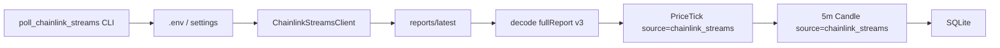
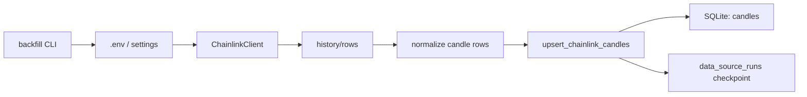
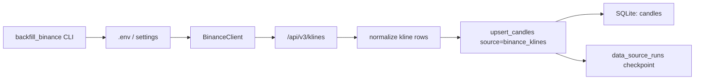
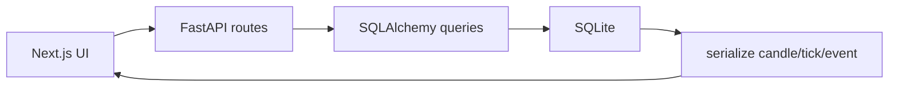
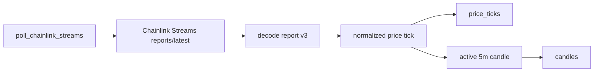

# Архитектура проекта

Документ описывает текущую архитектуру MVP крипто-дашборда для анализа 5-минутных свечей BTC, ETH и SOL.

## Цель системы

Система должна:

- получать исторические и realtime-данные цен BTC/ETH/SOL;
- строить и хранить 5-минутные свечи;
- считать candle/window metrics;
- находить дисбалансы и экстремальные движения;
- отдавать данные через API;
- показывать их в dashboard UI.

## Текущий стек

- Frontend: Next.js / React / TypeScript / `lightweight-charts`.
- Frontend quality: ESLint 9, `tsc --noEmit`, Next production build.
- Backend: FastAPI / Python.
- DB: SQLite для локального MVP.
- ORM: SQLAlchemy 2.
- Миграции: Alembic.
- HTTP client: httpx.
- Источник historical-кандидат: Chainlink Data Streams/DataEngine Candlestick API.
- Источник realtime MVP: Chainlink Data Streams HMAC API latest reports.

## Структура проекта

```text
poly_crypto/
  apps/
    web/
      app/                  # Next.js routes/layout/page
      components/           # dashboard UI и chart components
      lib/                  # API client и frontend-типы
      styles/               # глобальные стили
      package.json
      package-lock.json
      eslint.config.mjs
  services/
    api/
      app/
        api/
          routes/           # HTTP endpoints
        analysis/           # расчет метрик, imbalance detection, drilldown
        candles/            # candle builder, aggregator, storage, validator
        core/               # настройки приложения
        db/                 # модели, session, миграции
        feeds/              # клиенты источников данных
        scripts/            # backfill, seed, validation CLI
        workers/            # realtime worker
      alembic.ini
      requirements.txt
  docs/
  README.md
  CHANGELOG.md
  BACKLOG.md
  PROJECT_PLAN.md
  ARCHITECTURE.md
```

## Основные доменные сущности

### Asset

`assets` хранит price feed assets:

- BTC;
- ETH;
- SOL.

Это не Polymarket markets и не outcome tokens. Это базовые активы, по которым строятся свечи.

### PriceTick

`price_ticks` хранит raw/normalized price observations.

В текущем MVP исторический backfill Chainlink Candlestick API пишет сразу свечи, а не тики. Realtime Chainlink Streams пишет каждый latest report в `price_ticks` с `source = chainlink_streams`; эти тики используются для сборки локальных 5-минутных свечей.

### Candle

`candles` хранит агрегированные свечи:

- asset;
- timeframe;
- timestamp_start;
- timestamp_end;
- open/high/low/close;
- nullable volume;
- tick_count;
- first_tick_time;
- last_tick_time;
- color;
- source;
- raw_payload.

Для historical Chainlink candles:

- `source = chainlink_candlestick`;
- `tick_count = 0`, потому что raw ticks не приходят;
- `first_tick_time` и `last_tick_time` nullable.

Для realtime Chainlink Streams candles:

- `source = chainlink_streams`;
- `tick_count` равен количеству stream observations внутри 5m окна;
- `first_tick_time` и `last_tick_time` заполняются timestamp-ами полученных reports;
- `raw_payload` содержит нормализованный report payload для audit/debug.

### ImbalanceEvent

`imbalance_events` хранит найденные события:

- резкое движение;
- аномальное тело свечи;
- аномальная тень;
- серии green/red;
- z-score/percentile based events.

Расчет выполняется batch-командой `python -m app.scripts.recalculate_imbalances`. Источник свечей (`binance_klines`, `chainlink_candlestick`, `chainlink_streams`) сохраняется в `metadata.source`, чтобы события можно было фильтровать без смешивания источников.

### DataSourceRun

`data_source_runs` хранит состояние batch jobs:

- backfill;
- статус;
- checkpoint;
- ошибку;
- время старта/завершения.

Нужно для resumable backfill.

## Источники данных

### Chainlink

Основной realtime-источник MVP. Historical Candlestick API оставлен как целевой источник, но сейчас заблокирован credentials.

Текущие настройки:

```text
CHAINLINK_BASE_URL=https://priceapi.dataengine.chain.link
CHAINLINK_STREAMS_BASE_URL=https://api.dataengine.chain.link
CHAINLINK_USER_ID=
CHAINLINK_API_KEY=
CHAINLINK_PRICE_DECIMALS=18
CHAINLINK_SYMBOL_BTC_USD=BTCUSD
CHAINLINK_SYMBOL_ETH_USD=ETHUSD
CHAINLINK_SYMBOL_SOL_USD=SOLUSD
CHAINLINK_FEED_BTC_USDT=
CHAINLINK_FEED_ETH_USDT=
CHAINLINK_FEED_SOL_USD=
```

Используемые endpoints:

- `POST /api/v1/authorize`;
- `GET /api/v1/history/rows`.

Historical Candlestick API сейчас заблокирован на авторизации: текущие Streams credentials дают `401 Unauthorized` на `/api/v1/authorize`.

Для realtime используются:

- HMAC-аутентификация Chainlink Data Streams;
- `GET https://api.dataengine.chain.link/api/v1/reports/latest?feedID=...`;
- feedID BTC/USDT, ETH/USDT и SOL/USD из `.env`.

Ожидаемый формат строки:

```text
[time, open, high, low, close, volume]
```

Цена нормализуется через `CHAINLINK_PRICE_DECIMALS`.

### Binance historical fallback

Binance используется как временный/практический historical spot-like OHLCV source, чтобы не блокировать dashboard и фазу 6 из-за Chainlink Candlestick `401`.

Текущие настройки:

```text
BINANCE_BASE_URL=https://api.binance.com
BINANCE_SYMBOL_BTC_USDT=BTCUSDT
BINANCE_SYMBOL_ETH_USDT=ETHUSDT
BINANCE_SYMBOL_SOL_USDT=SOLUSDT
BINANCE_KLINES_LIMIT=1000
BINANCE_REQUEST_SLEEP_SECONDS=0.1
BINANCE_RETRY_ATTEMPTS=5
BINANCE_RETRY_SLEEP_SECONDS=2.0
BINANCE_TIMEOUT_SECONDS=60.0
```

Используемый endpoint:

- `GET /api/v3/klines`.

Свечи сохраняются в `candles` с `source = binance_klines`. Это spot-market OHLCV Binance, не Polymarket outcome-token prices и не Chainlink oracle report.

### Chainlink Streams realtime



Polling MVP запускается каждые 10 секунд. Свечи режутся по строгим UTC 5-минутным окнам; 10 секунд - это частота наблюдений внутри окна, а не сдвиг timestamp свечи.

Live-история хранится в два слоя:

- `price_ticks` - первичный audit/source-of-truth слой для каждого успешно полученного Chainlink latest report;
- `candles` - агрегированные 5m OHLC-свечи `source = chainlink_streams`, построенные из ticks.

При старте `poll_chainlink_streams` выполняет repair-проход: пересобирает realtime candles из уже сохраненных `price_ticks`. Это защищает от локальных сбоев агрегации, но не восстанавливает интервалы, в которые worker вообще не получал Chainlink reports.

Для локального Windows MVP worker удерживается через `ops/windows/run-chainlink-worker.ps1`. Скрипт запускается из Startup fallback, если Task Scheduler недоступен, и использует single-instance mutex, чтобы повторный launcher не создавал несколько одинаковых watchdog-процессов.

### Polymarket

Polymarket в текущем MVP не является источником spot-price данных. Он остается контекстом для будущего связывания price feed assets с markets/contracts.

Важно:

- Polymarket CLOB prices - это prices outcome-токенов, а не spot BTC/ETH/SOL.
- Resolution rules нужно проверять отдельно по каждому market.

## Поток historical backfill



Binance fallback использует тот же storage boundary:



Backfill запускается командой:

```powershell
python -m app.scripts.backfill --asset BTC --days 1
```

Для проверки без сетевого запроса:

```powershell
python -m app.scripts.backfill --dry-run --asset all --days 90
```

Binance fallback:

```powershell
python -m app.scripts.backfill_binance --asset all --days 90
python -m app.scripts.backfill_binance --asset all --years 5
```

После historical загрузки фаза 5 проверяется командой:

```powershell
python -m app.scripts.validate_candles --asset all --days 90
```

Валидатор проверяет gaps, duplicates, OHLC consistency, `source`, `timestamp_end` и выравнивание `timestamp_start` на 5-минутные границы. Диагностический режим `--source all` можно использовать для проверки локально накопленных realtime candles вместе с historical candles.

Фаза 5 закрыта Binance fallback: за период `2026-02-17T20:00:00Z..2026-05-18T20:00:00Z` загружено по 25 920 5m candles BTC/ETH/SOL с `source = binance_klines`, валидатор не показывает ошибок.

## Поток API чтения



Готовые read endpoints:

- `GET /api/status`;
- `GET /api/status/sources`;
- `GET /api/assets`;
- `GET /api/candles`;
- `GET /api/candles/{id}/drilldown`;
- `GET /api/ticks`;
- `GET /api/analysis/window`;
- `GET /api/imbalances`.

`GET /api/candles` и `GET /api/analysis/window` поддерживают `source`, чтобы не смешивать `binance_klines`, `chainlink_candlestick` и `chainlink_streams`.
`GET /api/imbalances` поддерживает `source`, `event_type`, `direction`, `min_severity`, `window_size` и временное окно.
`GET /api/status/sources` возвращает health-сводку по источникам: количество свечей и тиков, первые/последние timestamps, свежесть Chainlink Streams worker-а, последний `data_source_runs` и блокировку `chainlink_candlestick` из-за `401`.

## Frontend tooling

Frontend находится в `apps/web`.

Текущий dashboard реализован как client-side Next.js UI, который читает существующие backend endpoints без изменения API-контрактов:

- `GET /api/assets`;
- `GET /api/status/sources`;
- `GET /api/candles`;
- `GET /api/analysis/window`;
- `GET /api/imbalances`;
- `GET /api/candles/{id}/drilldown`.

Основные элементы UI:

- overview cards BTC/ETH/SOL;
- спокойная dark hero-карточка в graphite/teal/indigo-палитре;
- candlestick chart через `lightweight-charts`;
- filters: asset, source, period, direction, event type, severity, optional event window;
- latest candles table;
- imbalance events table;
- heatmap дисбалансов по активам и event type;
- candle drill-down;
- CSV/JSON export текущей выборки.

Проверочные команды:

```powershell
npm run lint
npm run test
npm run build
```

Текущее значение `npm run test` - TypeScript typecheck через `tsc --noEmit`. Реальные unit-тесты еще не добавлены.

ESLint проверяет исходники проекта и игнорирует generated artifacts: `.next`, `node_modules`, `out`, `next-env.d.ts`.

## Hardening и deploy artifacts

Для фазы 9 добавлен единый локальный predeploy-check:

```powershell
powershell -NoProfile -ExecutionPolicy Bypass -File .\ops\check-local.ps1
```

Он запускает backend compile, backend unit/API tests, frontend lint, frontend typecheck, frontend build и optional API health-check.

Backend test suite включает unit-тесты доменной логики и API-тесты основных routes. API-тесты используют isolated in-memory SQLite DB через FastAPI dependency override, не трогая локальную рабочую `poly_crypto.db`.

Для серверного MVP подготовлены systemd-шаблоны:

- `ops/linux/poly-crypto-api.service.example`;
- `ops/linux/poly-crypto-chainlink-worker.service.example`;
- `ops/linux/poly-crypto-web.service.example`;
- `ops/linux/poly-crypto-nginx-8080.conf.example`.

Подробный порядок Git/server deploy описан в `docs/deployment-runbook.md`.

Текущий VPS-контур развернут на `155.212.183.185`:

- внешний dashboard: `http://155.212.183.185:8080`;
- Nginx слушает `0.0.0.0:8080`;
- frontend `poly-crypto-web.service` слушает `127.0.0.1:13000`;
- API `poly-crypto-api.service` слушает `127.0.0.1:18000`;
- Chainlink Streams worker `poly-crypto-chainlink-worker.service` работает через `systemd` с `Restart=always`;
- SQLite backup `poly-crypto-db-backup.timer` запускается каждый час и хранит последние 48 копий в `/opt/poly_crypto/backups/sqlite`.

## Поток realtime

Realtime MVP реализован как hardened CLI/service worker:



Worker запускается командой:

```powershell
python -m app.scripts.poll_chainlink_streams --asset all --interval 10
```

Для локального Windows MVP добавлен слой supervisor-а через Task Scheduler:

```text
ops/windows/run-chainlink-worker.ps1
ops/windows/register-chainlink-worker-task.ps1
ops/windows/status-chainlink-worker-task.ps1
ops/windows/unregister-chainlink-worker-task.ps1
```

`run-chainlink-worker.ps1` работает как watchdog: запускает CLI worker, пишет логи в `services/api/logs` и перезапускает worker после падения. `register-chainlink-worker-task.ps1` регистрирует задачу Windows при входе пользователя, чтобы накопление `chainlink_streams` не зависело от открытого терминала.

Команда делегирует в `app.workers.realtime_worker`, где находятся:

- retry/backoff для временных ошибок Chainlink Streams;
- логирование сетевых ошибок и повторных попыток;
- in-memory active candle state по asset;
- диагностика пропущенных 5m окон;
- implicit finalization: при появлении report из нового 5m окна предыдущая свеча больше не обновляется и считается закрытой;
- пересчет свежих `imbalance_events` по закрытым realtime-свечам `source = chainlink_streams`.

## Backend-модули

### `core`

`core/config.py` читает `.env` через Pydantic Settings.

### `db`

- `models.py` - SQLAlchemy models.
- `session.py` - engine/session factory.
- `migrations` - Alembic migrations.

### `feeds`

- `chainlink.py` - auth и history client.
- `chainlink_streams.py` - HMAC Data Streams latest report client и decoder report v3.
- `symbols.py` - mapping asset -> Chainlink symbol.
- `normalizer.py` - задел под tick normalization.

### `candles`

- `builder.py` - цвет свечи.
- `aggregator.py` - 5m time helpers.
- `storage.py` - query/upsert/serialization.
- `realtime_storage.py` - запись Chainlink Streams reports в `price_ticks` и 5m `candles`.
- `validator.py` - OHLC/gap/source/timestamp validation.

### `analysis`

- `window_metrics.py` - расчет метрик по окну свечей.
- `imbalance_engine.py` - detection engine для percent move, streaks, body/wick/body-range, rolling mean/median, z-score и percentile events.
- `imbalance_storage.py` - сериализация, замена и запись `imbalance_events`.
- `drilldown.py` - признаки отдельной свечи.

### `api/routes`

HTTP-слой, который не должен содержать тяжелую бизнес-логику. Расчеты и storage вынесены в отдельные модули.

## База данных

Текущая БД:

```text
services/api/poly_crypto.db
```

Миграция:

```powershell
python -m alembic upgrade head
```

Seed:

```powershell
python -m app.scripts.seed_assets
```

## Принципы архитектуры

- Не смешивать spot price assets и Polymarket outcome-token prices.
- Не хардкодить API keys.
- Все credentials хранить в `.env`.
- Исторические Chainlink candles хранить отдельно от realtime ticks.
- Raw payload сохранять для audit/debug.
- Backfill должен быть resumable.
- API endpoints должны быть тонкими.
- Бизнес-логика должна жить в `analysis`, `candles`, `feeds`.

## Текущие ограничения

- SQLite подходит для MVP и уже работает на VPS, но для production-нагрузки позже лучше перейти на PostgreSQL/TimescaleDB.
- Chainlink historical candles могут не давать raw ticks.
- Chainlink Candlestick historical backfill сейчас заблокирован `401 Unauthorized` на `/api/v1/authorize`; текущие HMAC credentials работают для Streams latest reports, но не для Candlestick API.
- Полноценный historical drill-down ограничен OHLC-признаками.
- Realtime worker реализован как CLI/service polling worker с retry/backoff; локальный Windows watchdog оставлен как fallback, а основной 24/7 worker запущен на VPS через `systemd`.
- Imbalance events рассчитываются batch-процессом по historical candles и автоматически обновляются worker-ом для свежих закрытых realtime-свечей `source = chainlink_streams`.
- Frontend dashboard реализован в MVP-объеме; пока нет сохранения фильтров в URL/localStorage, pagination/virtualization таблиц и отдельного режима сравнения источников.
- Polymarket historical слой еще не реализован и должен храниться отдельно от spot candles.
- Внешний backup пока не настроен: ежечасные SQLite backups лежат на том же VPS.
