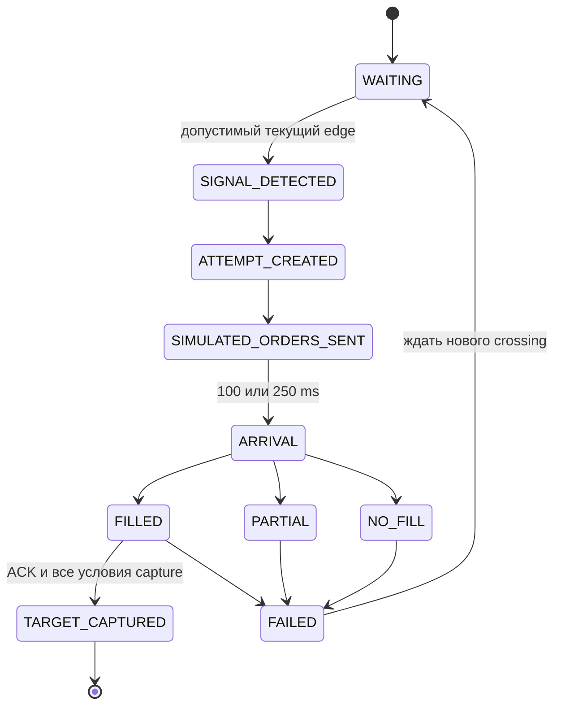

# Локальный shadow engine и журнал — Iteration 1

Дата: 10 сентября 2026. Ветка разработки: `codex/prediction-live-shadow`.

Отдельная фиксация принятой итерации: [воспроизведение из Git и точный allowlist](docs/shadow-engine-git-reproduction.md). Engine и synthetic-проверки автономны от незакоммиченных файлов; исторические числа требуют внешних входов с закреплёнными SHA-256. Datasets и журналы в Git не включаются.

**Iteration 1 завершена: локальный engine проверен, live integration не выполнена.** Реализован forward-only engine для `micro_arb_v0`. Его вход — типизированные события и монотонные watermarks; выход — журнал попыток и окон. Подключение к production collector, запуск на VPS, dashboard и execution preflight не входят в эту итерацию. Действующий 24h collector-трек остаётся отдельным процессом.

## A. Неизменяемый config

`ShadowStrategyConfig` — frozen dataclass с обязательным UTC `created_at`, валидацией фиксированных значений, сериализацией и SHA-256 канонического JSON. `from_json` повторно проверяет профиль и hash. После начала эксперимента config не заменяется через публичный интерфейс engine. Для воспроизводимого historical replay используется время создания 2026-09-10 00:00:00 UTC; это метка конфигурации, а не утверждение о времени запуска.

| Параметр | Контракт |
| --- | --- |
| Профиль | `micro_arb_v0`, версия `1.0.0`, BTC 5m |
| Направление A | BUY YES Limitless + BUY NO Polymarket |
| Направление B | BUY YES Polymarket + BUY NO Limitless |
| Q | 10 целевых удержанных shares, Decimal |
| Цель | $0,50 net попытки **и** накопленного net окна |
| Вход | `0.10 < executable gross edge <= 0.15`, predicted net > 0 |
| TTE | Строго >30 секунд; применяется более строгий из receive UTC и монотонного остатка |
| Задержки | Два независимых сценария: 100/100 и 250/250 ms |
| Исполнение | Parallel, force/IOC-подобная модель видимой глубины V1 |
| ACK | Signal + 2 × outbound latency; capture фиксируется при ACK |
| Limitless | 3% gross contracts, удержание округляется вверх до 1e−6 |
| Polymarket | Допущение V1: `sum(q × 0.07 × p × (1−p))`, вверх до 1e−5 на заявку |
| Friction | 0,0025 × максимальный retained Q двух ног |
| Повторы | До трёх попыток суммарно A/B на сценарий и окно, только после нового crossing |
| Capture | Полное исполнение обеих ног, residual≤0,01, net попытки≥0,50, net окна≥0,50 |
| Лимит captures | Один на окно и сценарий |
| Остаток | Оценка 0; matched payout — условная выплата при совместимом settlement |

Q — не размер отправляемой gross-заявки Limitless. По текущей signal book вызывается существующий `gross_request`: при достаточной глубине и 3% Q10 требует 10,309279 gross shares. Этот запрос фиксируется до arrival. Поле edge — `1 − VWAP_LL − VWAP_Poly` по соответствующим gross requests, а не простой BBO spread и не всегда Q10 edge observer.

Вход с predicted net >0, а не обязательным predicted net≥target, сохранён из исторического `family=fixed_threshold`. Параметры не оптимизировались. Все правила rounding, entry/capture, depletion и разрешения одновременных событий входят в config contract.

## B. Модель событий

`ShadowEvent` содержит `event_id`, `kind`, canonical market, receive UTC, monotonic ns, ordinal, source session, quality, venue/outcome, атомарный tuple книг и при необходимости `WindowSpec`.

Поддерживаются `MARKET_DISCOVERED`, `MARKET_ROTATED`, `BOOK_VALID`, `BOOK_UPDATE`, `BOOK_INVALID`, `DESYNC`, `CONNECTION_DOWN`, `CONNECTION_UP`, `WINDOW_START`, `WINDOW_END`. Несколько изменившихся книг одного сообщения передаются одним атомарным событием. `MARKET_DISCOVERED` сохраняет metadata и не ротирует активное окно заранее.

`ShadowBook` содержит неизменяемую ask ladder с Decimal, status, book receive ns, отдельные deadlines свежести и здоровья соединения, version, source session, connection и известный minimum. Входной слой обязан уже выполнить protocol reconstruction, BBO safety checks и нормализацию Limitless. Этот engine не заменяет проверенные `books.py` adapters. `BOOK_VALID` означает подтверждённое полное состояние, `BOOK_UPDATE` не восстанавливает книгу после DESYNC/reconnect без такого состояния. Heartbeat/CONNECTION_UP не превращает старую книгу в VALID.

Контракт порядка: один source clock session на экземпляр engine; ordinal строго возрастает, monotonic не убывает. Повторные/переставленные ordinals и будущие book timestamps отвергаются. Невалидный reconnect-placeholder со сброшенным book timestamp допускается, регрессия валидной книги — нет. Смена clock session требует нового эксперимента; автоматического переноса inventory через рестарт нет.

`InMemoryEventTransport.publish` вызывает consumer синхронно, не накапливает поток и обеспечивает естественный backpressure. `watermark(t)` означает, что consumer больше не получит событие с receive ns<t. Consumer сначала выполняет timers≤t по уже полученным книгам, затем применяет новое событие. При одинаковом timestamp timer предшествует receive event; обработчик никогда не берёт ближайшую будущую книгу. Для будущего live adapter понадобится отдельная проверка очереди/watermarks, не простое чтение `live.json`.

## C. Автомат состояний и причинность



Терминальная запись попытки остаётся FAILED либо TARGET_CAPTURED; WAITING относится к ledger окна. Arrival обеих ног независим от второго latency-сценария. ACK не меняет книгу исполненной ноги задним числом. Книги после arrival не влияют на её fill. Таймеры продолжают работать при отсутствии новых сообщений; сроки свежести ограничивают и fills, и coverage.

Первый вход допускается по первой подходящей наблюдаемой котировке, как в Target Profit V1. После попытки engine разоружает вход. Только наблюдаемые валидные Q10-котировки **обоих направлений** с edge≤0,10 после ACK разрешают новый crossing. Верхний cap, недостаточная depth, истечение TTL, DESYNC и reconnect не считаются снижением edge. Gap после наблюдаемого снижения снова снимает разрешение, чтобы не продлевать crossing через разрыв. Новый положительный event проверяет доступную глубину с собственным consumption ledger.

При выборе A/B используются минимальный Q=10, максимальный текущий predicted net, затем меньший residual и стабильный tie-break A/B. Будущие maxima эпизодов не участвуют. Журнал max edge нужен только для диагностики после наблюдения.

WINDOW_END автоматически закрывает активное окно по clock deadline. Ранний explicit WINDOW_END или `finish()` сохраняет фактически исполненные ноги и помечает незавершённость. Будущие fills и coverage не дорисовываются. Следующий рынок получает пустые книги, новые ledgers и лимиты попыток.

## D. Модель журнала

`ShadowAttempt` связывает attempt ID, общий signal event ID, окно, config hash/version, направление, Q, signal UTC/ns/ordinal, edge, predicted net, TTE, signal books и latency-сценарий. Каждая нога хранит venue/outcome, requested/gross/retained Q, arrival time/book, VWAP, worst price, статус и причину, cash/contracts fees, consumed depth и source ordinal.

После ACK сохраняются matched Q, residual Q, cash fees, withheld contracts, friction, gross PnL, simulated net, result и точная последовательность переходов с UTC/monotonic clocks. Здесь gross PnL — retained matched payout floor минус покупная стоимость; удержанные LL contracts уже учитываются через retained Q. Net дополнительно вычитает cash fees и friction. Эти показатели не называются realized PnL.

`ShadowWindow` хранится отдельно для 100 и 250 ms: canonical market, реальные market IDs, start/end, match quality, observed start, valid coverage ns, IDs попыток, выбранные направления, maxima edge A/B, capture timestamp/time-from-start, накопленный simulated net и failure/close reasons. Окна без сигнала также записываются. Полная длительность окна — 300 секунд; coverage не включает ненаблюдаемое начало и ограничивается минимальным book/connection deadline.

Ledger depletion общий для A/B внутри сценария и сохраняется по venue/outcome/price до конца окна. Новая snapshot не восполняет использованную ликвидность. Между 100 и 250 ms нет общего consumption или capture state. NO Limitless — ask из зеркала YES bid; его не прибавляют к YES ask как повторную копию одного пула.

## E. Storage abstraction

`ShadowJournalRepository` задаёт только `append(kind, key, payload)` и `records(kind)`. Реализации:

- `InMemoryShadowJournal`: копии через каноническую сериализацию, caller не может изменить сохранённые записи.
- `JsonlShadowJournal`: новый exclusive файл, append-only записи, flush+fsync после append. Повторное открытие для записи запрещено; read-only чтение закрытого файла доступно через `read`.

Журнал содержит config, metadata, quality incidents и последовательные версии attempts/windows. Последняя версия по key — актуальная проекция. Полный raw L2 поток сюда не пишется; только signal/arrival books для объяснения конкретной попытки. Источником replay остаётся отдельный historical cache/raw storage.

Оборванная JSONL-строка вызывает ошибку чтения; автоматического удаления хвоста нет. Ошибка записи распространяется вызывающему коду, и такой эксперимент нужно остановить. Продолжение после crash, transactional outbox, PostgreSQL и service restart policy остаются отдельными задачами перед live integration. Новая реализация repository не требует изменения финансовой domain logic. Основная SQLite проекта и её schema не менялись.

## F. Historical replay и parity

Проверка выполняется командой из `services/api` в **новый** output-каталог:

```powershell
.venv/Scripts/python.exe -m app.scripts.replay_prediction_shadow ../../target-profit-research-v1 data/prediction/recovery-20260910/dataset ../../shadow-engine-v1-new --workers 3
.venv/Scripts/python.exe -m app.scripts.verify_prediction_shadow ../../shadow-engine-v1-new
.venv/Scripts/python.exe -m app.scripts.audit_prediction_shadow ../../target-profit-research-v1 ../../shadow-engine-v1-new
```

Для короткой локальной проверки добавьте `--limit 1`; это subset, не завершённая проверка 122 окон. CLI не содержит сетевых вызовов, не запускает collector и отклоняет output внутри исторических источников. Список разрешённых окон и cache SHA-256 берётся из manifest, protocol exclusions — из observation replay. Реальные market IDs и source session читаются из сохранённых markets. Каждый файл source cache сверяется с manifest до чтения и повторно после расчёта. Baseline-файл также хешируется до/после.

`shadow_replay.py` превращает последовательные строки cache в события без передачи engine объекта timeline или метода `snapshot(future_ns)`. Затем весь поток повторяется заново; сравниваются канонические журналы целиком и их SHA-256. Сравнение V1 ограничено `parent_config_id=583`, `cap15` и `250ms_cap15`; CLI проверяет параметры reference rows перед сопоставлением. Независимый verifier пересчитывает fees, inventory и net из consumed levels, проверяет причинность и capture. Audit воспроизводит только необходимый prefix для диагностики отвергнутых старых signals; это не контрфактическая атрибуция PnL.

Исторический cache содержит derived version refs и объединённый deadline. Поэтому adapter явно обозначает `cache-ref` и `cache:connection-unavailable`, дублирует объединённый deadline в две границы и не выдаёт их за оригинальные venue versions или connection IDs. Полный replay protocol→raw был выполнен в предыдущем research; здесь проверяется новый consumer по его сохранённой receive projection. Cache truncation ≥200 shares достаточна для максимум трёх Q10 попыток. Исторические источник и baseline не исправляются под новый engine.

**Полный прогон завершён:** 122 разрешённых окна / 10 ч 10 мин календарного объёма, 6 890 599 receive rows, каждый поток воспроизведён дважды. Все 122 пары журналов побитово эквивалентны по каноническому JSON/SHA-256. Источник — historical recovery, это не новый live dataset. Два protocol-unsafe окна 1788976500/1788976800 сохранены в exclusions.

Артефакты: [summary.json](shadow-engine-v1-validated/summary.json), [config.json](shadow-engine-v1-validated/config.json), [verification.json](shadow-engine-v1-validated/verification.json), [parity-audit.json](shadow-engine-v1-validated/parity-audit.json), [provenance.json](shadow-engine-v1-validated/provenance.json). Для каждого окна сохранены `*.journal.jsonl` и `*.comparison.json`. Config hash: `18090425a1d6ff349d2b5b159c974a0d068cc2f9a6c0edbce43794b4c0b6aa19`.

| Метрика | 100 ms | 250 ms |
| --- | ---: | ---: |
| Окна | 122 | 122 |
| Полное совпадение signals/net/capture с V1 | 117 | 116 |
| Попытки нового engine | 97 | 97 |
| Попытки V1 | 97 | 99 |
| Captures нового engine | 83 | 82 |
| Captures V1 | 83 | 81 |
| Simulated net нового engine, $ | 35,1978121770 | 29,3677004530 |
| Simulated net V1, $ | 35,4553659070 | 26,9135945550 |
| Общие попытки с тем же signal ns/direction | 92 | 91 |
| Расхождения net общих попыток | 0 | 0 |

Итог parity: **SEMANTIC_DIFFERENCES**, а не EXACT. Независимый verifier проверил 244 scenario-window записи, 194 попытки и 388 ног: **PASS**. Он проверяет hashes, причинность, sizes, цены, fees, inventory, PnL, capture и coverage. Сценарии не объединяются в одну стратегию или общий PnL. Денежные результаты условны при UNKNOWN settlement/FEE_UNKNOWN; рост результата 250 ms не является оптимизацией или доказательством преимущества.

Каталог `shadow-engine-v1/` содержит незавершённую диагностическую попытку, остановленную проверкой reconnect timestamp; он не является успешным результатом. `shadow-engine-v1-smoke/` — только первое окно ранней версии config, не совместимой с финальным hash. Оба каталога сохранены как диагностика, исходные datasets не изменялись. Итоговые данные находятся только в `shadow-engine-v1-validated/`.

## G. Тесты

Новые synthetic unit-тесты проверяют crossing, open/closed edge boundaries, отсутствие повторного входа, retry/max3, прекращение после capture, A/B, minimum/depth, independent ledgers, partial/one-leg/no-fill, точные fees/friction, учёт предыдущих потерь, latency causality и события на timestamp arrival, invalidation/recovery, свежесть и connection deadline без сообщений, gaps, TTE, discovery/rotation, пустые окна, раннее завершение, ordering/session rejection, immutable config, storage и детерминированный replay.

```powershell
.venv/Scripts/python.exe -m unittest tests.test_prediction_shadow -v
.venv/Scripts/python.exe -m unittest discover -s tests
.venv/Scripts/python.exe -m ruff check app/prediction app/scripts/replay_prediction_shadow.py app/scripts/verify_prediction_shadow.py app/scripts/audit_prediction_shadow.py tests/test_prediction_shadow.py
```

Финальный полный backend suite: **158/158 PASS**, 27,723 секунды. Включены **30 новых shadow-тестов**. Scoped Ruff и compileall — **PASS**. Независимый verifier также имеет synthetic тест: корректный journal принимается, повреждённая стоимость ноги обнаруживается даже после пересчёта digest. Frontend в Iteration 1 не изменён; его build не относится к этой итерации.

SHA-256 семи переиспользованных modules (`target_profit`, `target_replay`, `execution_simulator`, `execution_fees`, `execution_replay`, `books`, `models`) совпали с сохранённым provenance Target Profit V1. Код исторической финансовой модели не менялся.

## H. Отличия от Target Profit V1

1. Строгий наблюдаемый below-threshold crossing: V1 мог rearm после отсутствия выбранной котировки, в том числе выхода выше cap; новый engine этого не допускает. Invalid не подтверждает below и не сохраняет старое разрешение через gap.
2. Для нового входа требуются все четыре VALID books; V1 мог использовать две ноги одного направления при проблеме других книг. Arrival проверяет каждую исполняемую ногу отдельно, поэтому one-leg остаётся возможным.
3. Timer исполняется до receive event на том же ns. Historical `snapshot` использовал все receive≤arrival, включая совпадающий timestamp. Это явно фиксированный tie-break, не выбор более выгодной цены.
4. TTE использует более строгую оценку двух clocks. Первый и последний ненаблюдаемые фрагменты не становятся новой наблюдаемой coverage.
5. Engine получает только префикс событий и сохраняет полный audit trail; V1 предварительно индексировал весь timeline. Финансовые функции, Q, fees, rounding, friction, capture и persistent depletion переиспользованы без изменения.

Расхождения обнаружены в шести уникальных окнах. Prefix-аудит объяснил **все 13** отсутствующих старых signals, необъяснённых — **0**:

- 10 signals в пяти окнах (1788973800, 1788975300, 1788981600, 1788985200, 1788989700; оба latency-сценария) отклонены до восстановления всех четырёх книг. В первых четырёх окнах начальный signal B сдвинулся примерно на 3,7–4,2 ms; в 1788989700 следующий допустимый вход стал A, что уменьшило net обоих сценариев на $0,2575537300.
- Два retry signals 250 ms (1788975300, 1788998700) отклонены из-за отсутствия нового подтверждённого crossing после ACK/gap. В последнем окне исключённая попытка V1 давала +$0,7480524440; более строгая политика может ухудшать результат.
- Ещё один old signal 250 ms в 1788975300 отклонён по cap: при новом independent ledger edge=0,157>0,15. В V1 к этому времени уже существовало другое потребление ликвидности после дополнительной попытки. Итоговые последовательности и window net поэтому различаются.

Все **183 общие попытки** имеют точное совпадение Decimal net. Финансовая модель не подстраивалась под результат. Parity не объявляется полной только по совпадению агрегированного PnL; подробные состояния и quotes находятся в `parity-audit.json`.

## I. Изменённые файлы

- Новые domain/event/config модели: `services/api/app/prediction/shadow_models.py`.
- Engine и локальный transport: `services/api/app/prediction/shadow_engine.py`.
- Storage protocol и implementations: `services/api/app/prediction/shadow_storage.py`.
- Historical event adapter: `services/api/app/prediction/shadow_replay.py`.
- Локальный CLI и сравнение: `services/api/app/scripts/replay_prediction_shadow.py`.
- Независимая проверка журналов и разбор parity: `services/api/app/scripts/verify_prediction_shadow.py`, `services/api/app/scripts/audit_prediction_shadow.py`.
- Synthetic tests: `services/api/tests/test_prediction_shadow.py`.
- Этот design/report и актуализация `PROJECT_PLAN.md`, `BACKLOG.md`, `ARCHITECTURE.md`, `README.md`, `CHANGELOG.md`.
- Отдельные новые replay artifacts; исходные `target-profit-research-v1/` и raw datasets не редактировались.

Незакоммиченные результаты предыдущего research сохранены. Во время работы соседний трек добавлял telemetry/ops/docs в общий checkout; его изменения не являются частью реализации shadow и не откатывались. Ветка создана от `a7de005`. На момент первоначального отчёта commit/push/deploy не выполнялись; последующим заданием разрешены только allowlisted commit/push принятой Iteration 1, без deployment.

## J. Риски и границы готовности

- Settlement UNKNOWN и FEE_UNKNOWN сохраняются. Привязка fees/minimum/rounding/taker delay к реальным рынкам не доказана этим offline прогоном.
- Arrival book — наблюдаемая receive-book proxy; matching-engine book и queue competition неизвестны. Force fills не являются FOK execution и не дают разрешения orders.
- Нет price guard или emergency hedge: это сохранённая модель V1, а не готовый live router.
- Cache provenance ограничен производной проекцией. Для будущего live потребуется проверенный producer со source session/connection/version и bounded delivery lag, без ослабления BBO checks.
- JSONL реализация подходит для локальных экспериментов, не заявляет transactional crash recovery. Не возобновлять interrupted experiment с пустым ledger.
- Общий checkout изменяется соседним треком. Перед будущим release нужен отдельный source allowlist и review; collector release на VPS этим заданием не менялся.

## K. План Iteration 2

Только после отдельного подтверждения: добавить `Prediction Arb` в существующий Next.js dashboard, переиспользовать `lightweight-charts` и существующие API conventions. Создать локальные read endpoints current/windows/attempts/stats/health поверх journal projection; отделить сценарии 100/250 ms. Реализовать timeline signal→arrival→fill→capture, детали попытки, журнал, историю пустых/невалидных окон и cumulative simulated net. Проверить browser, backend tests, frontend lint/types/build. Подключение к VPS в этот шаг автоматически не входит.

**После итогового отчёта — STOP. Iteration 2 и Iteration 3 не начаты.**
